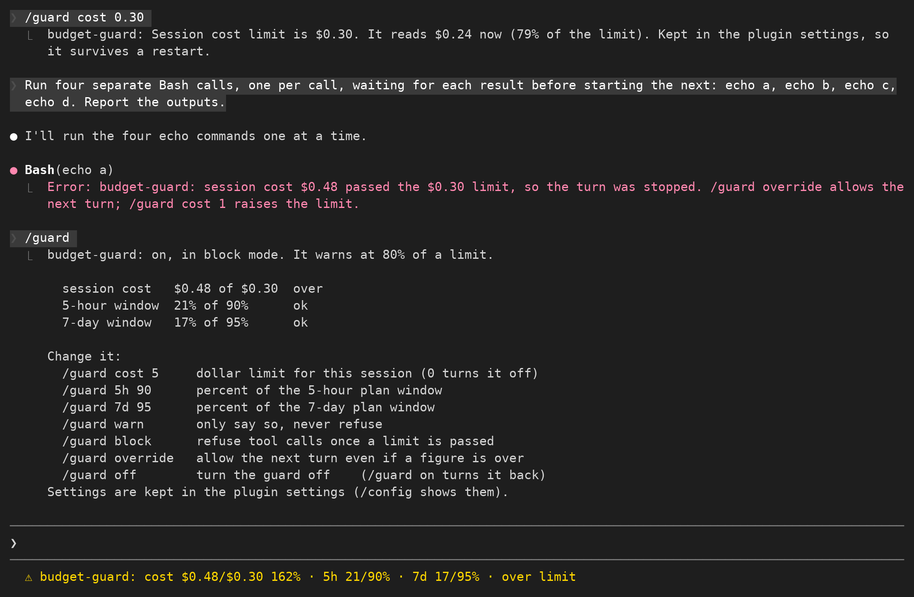

# budget-guard

A spending guard for Claude Code, built as a mod (function hooks).

It watches three figures, each with a limit you set, and stops work before the limit turns into a surprise:

- the session cost in dollars,
- how much of the 5-hour plan window is used,
- how much of the 7-day plan window is used.

It stays invisible while everything is fine.
No status line, no toasts, nothing.

## What it does

**At 80% of a limit** it toasts once and pins a line under the prompt:

```
budget-guard: cost $4.10/$5.00 82% · 5h 71/90% · 7d 15/95%
```

The line stays while any figure is at warn or over, and disappears the moment everything is back under the warn mark.
The toast is not repeated until the level changes.

**Past a limit, in `block` mode (the default)**, two things happen.

The next tool call is refused, including a subagent's, because subagents spend too, and the turn is stopped, because a model that is refused one tool tries another and every try is a billed API call:

```
● Bash(echo c)
  ⎿  Error: budget-guard: session cost $0.67 passed the $0.66 limit, so the turn was stopped.
     /guard override allows the next turn; /guard cost 2 raises the limit.
```

And sending a new prompt asks first:

```
 ☐ Budget
Session cost is $0.59, past its $0.36 limit. Send this prompt anyway?
❯ 1. Send anyway
  2. Do not send
```

"Send anyway" sets an override for that one turn.
"Do not send" drops the prompt and says why:

```
● Prompt dropped by a hook: budget-guard: session cost $0.59 passed the $0.36 limit.
  The prompt was not sent. /guard override sends the next one; /guard cost 1 raises the limit.
```

**Past a limit, in `warn` mode**, nothing is ever refused.
The guard toasts once a turn and keeps the status line pinned, and that is all.

## Install

```
claude plugin marketplace add Arunjay4213/claude-mods
claude plugin install budget-guard@claude-mods
```

Mods are early access, so the module only loads when function hooks are switched on.
Add this to `~/.claude/settings.json`:

```json
{ "env": { "CLAUDE_CODE_ENABLE_FUNCTION_HOOKS": "1" } }
```

Or set it for one run: `CLAUDE_CODE_ENABLE_FUNCTION_HOOKS=1 claude`.

## Screenshot



## `/guard`

Run `/guard` on its own to see where everything stands:

```
budget-guard: on, in block mode. It warns at 80% of a limit.

  session cost   $0.31, no limit  not guarded
  5-hour window  14% of 90%       ok
  7-day window   15% of 95%       ok

Change it:
  /guard cost 5     dollar limit for this session (0 turns it off)
  /guard 5h 90      percent of the 5-hour plan window
  /guard 7d 95      percent of the 7-day plan window
  /guard warn       only say so, never refuse
  /guard block      refuse tool calls once a limit is passed
  /guard override   allow the next turn even if a figure is over
  /guard off        turn the guard off    (/guard on turns it back)
```

`/guard override` lasts exactly one turn.
A subagent's turn finishing inside your turn does not use it up.

## Settings

The six settings are the plugin's own `userConfig` fields, so `/config` shows them too.

| Field | Default | What it is |
| --- | --- | --- |
| `costLimitUsd` | `0` | Dollars this session may spend. 0 turns the cost guard off. |
| `fiveHourLimitPercent` | `90` | Percent of the 5-hour plan window allowed. |
| `sevenDayLimitPercent` | `95` | Percent of the 7-day plan window allowed. |
| `warnAtPercent` | `80` | How far along a limit counts as a warning. |
| `mode` | `block` | `block` refuses work past a limit, `warn` only says so. |
| `enabled` | `true` | Turn the whole guard off without uninstalling it. |

Changing one with `/guard` writes it through `$.config.set`, which lands in `~/.claude/settings.json` under `pluginConfigs["budget-guard"].options`, so it survives a restart.
Claude Code reloads the module when its options change, which is why `/guard cost 5` is followed by a short "options changed - reloaded" notice.

If a host ever refuses a plugin writing its own `userConfig` row, the guard falls back to `$.store` for the same six fields and `/guard` says "Kept in the plugin store" instead of "Kept in the plugin settings".
On the Claude Code build this was written against (2.1.272) the `$.config.set` path works, so the store fallback is the unusual case.

## Where the numbers come from

Everything is read with `$.session.usage()` and no argument, which is the free form: it reports the figures the last API response already carried, and computes nothing.

- `cost.usd` is the same dollar figure `/cost` and the status line show.
- `rateLimits[]` carries `five_hour` and `seven_day` with a `percentUsed`, rounded here with `Math.round`.

The reading is taken at `session.start`, after every turn, and inside `tool.call` before the guard decides, because cost keeps moving while a turn runs.

The `tool.call` read is measured once per session and the figure is written to the debug log:

```
[budget-guard] $.ui.log: session.usage() took 5 ms in tool.call - under 30 ms, so every check reads live
```

If the read comes back slower than 30 ms the guard caches it for 3 seconds instead of reading on every tool call.
Both paths were seen in testing: 5 ms on a cold worker and 62 ms on a reloaded one, where the cache switched itself on.

## Limitations

**A hook that throws or times out is skipped by the engine.**
The hooks beneath it and Claude Code's own logic run in its place.
That makes this a guard rail, not a lock: it is here to stop an expensive session from drifting past a budget you set, not to enforce a spending policy on someone who does not want it.
Anyone can turn it off with `/guard off`.

**The deny is advisory in one specific sense.**
It refuses the *next* tool call and then stops the turn.
API calls that have already started still finish and are still billed, so the cost can land a little past the limit before anything is refused.
In practice the overshoot is one model step.

**API-key sessions have no window guards.**
`rateLimits` is empty without a subscription, so the 5-hour and 7-day figures are never reported and those two guards stay inactive.
`/guard` says so plainly, and the cost guard still works.

**Cost settles between steps, not continuously.**
The engine's cost ledger updates as each API response is accounted for, so a short single-step turn can end past the limit without any tool call having been refused.
The next turn is then caught at `prompt.submit`.

**`$.ui.ask` needs someone to ask.**
In a `-p` or SDK run there is no one at the keyboard, so a prompt submitted while a figure is over is dropped with the reason rather than questioned.
`/guard override` or a higher limit is the way through.
