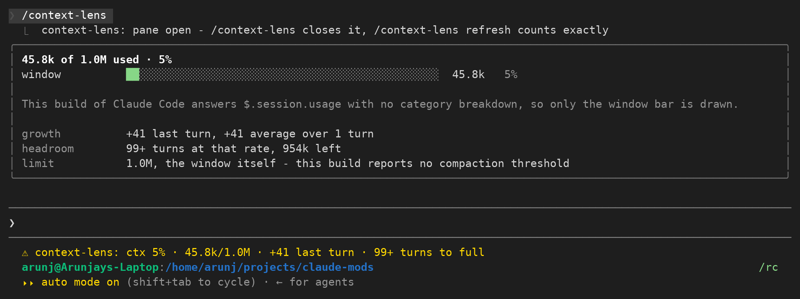

# context-lens

A live `/context`.

Claude Code's `/context` is a snapshot you have to ask for.
`context-lens` keeps the same figures on screen: a pinned line under the prompt that updates after every turn, and a pane with the window broken down by category.

## What it shows

A pinned status line under the prompt, from the moment the session starts:

```
ctx 5% · 45.9k/1.0M · +44 last turn · 99+ turns to full
```

Reading it left to right: how full the context window is, the tokens used against the window size, what the last turn added, and how many more turns fit at the recent average growth.
Any figure the engine has not reported yet is left out rather than guessed, so early in a session the line is shorter.
Before the first answer comes back it reads `ctx waiting for the first answer`.

`/context-lens` opens a pane with the same reading in full:

```
45.9k of 1.0M used · 5% · claude-opus-5
window          ██░░░░░░░░░░░░░░░░░░░░░░░░░░░░░░░░░░░░░░░░░░░░░░  45.9k   5%

messages        █░░░░░░░░░░░░░░░░░░░░░░░░░░░░░░░░░░░░░░░░░░░░░░░  22.4k   2%
system tools    █░░░░░░░░░░░░░░░░░░░░░░░░░░░░░░░░░░░░░░░░░░░░░░░  14.2k   1%
memory files    █░░░░░░░░░░░░░░░░░░░░░░░░░░░░░░░░░░░░░░░░░░░░░░░   4.9k   0%
system prompt   █░░░░░░░░░░░░░░░░░░░░░░░░░░░░░░░░░░░░░░░░░░░░░░░   3.1k   0%
autocompact bu… ██░░░░░░░░░░░░░░░░░░░░░░░░░░░░░░░░░░░░░░░░░░░░░░  45.0k   5%
free space      ████████████████████████████████████████████░░░░   910k  91%

growth          +4.2k last turn, +3.8k average over 5 turns
headroom        12 turns at that rate, 754k left
limit           800k, where auto-compaction runs
counted         locally, as an estimate - /context-lens refresh counts exactly
```

Each bar is sized to the pane's own width, so it fits the dock and the inline placement alike.

Running `/context-lens` again closes the pane.
`/context-lens refresh` counts every category with the token-count API, the way `/context` does, and says so in the `counted` row.



## How it reads the window

Everything comes from one call, `$.session.usage`.

After each finished turn the mod asks for `breakdown: "summary"`, which estimates locally and sends no requests, so the line costs nothing.
`/context-lens refresh` asks for `breakdown: "full"`, which sends one token-count request per tool and memory file.
That is the only thing in this mod that spends anything, and it only runs when you ask for it.

The growth figures come from a small in-memory list of the token count after each turn.
A compaction clears it, since the window it measured no longer exists.

The compaction line prefers the engine's own `autoCompactThreshold` from the breakdown.
When auto-compaction is off it falls back to the compaction window (`rawMaxTokens`), and when there is no breakdown at all it falls back to the context window size and says which it used, so the number is never presented as more than it is.

## Install

```
claude plugin marketplace add Arunjay4213/claude-mods
claude plugin install context-lens@claude-mods
```

Mods are early access, so the module only loads when the function-hooks flag is set.
Add it to `~/.claude/settings.json`:

```json
{
  "env": { "CLAUDE_CODE_ENABLE_FUNCTION_HOOKS": "1" }
}
```

or set it on the command line for one run:

```
CLAUDE_CODE_ENABLE_FUNCTION_HOOKS=1 claude
```

To run it from a checkout instead:

```
CLAUDE_CODE_ENABLE_FUNCTION_HOOKS=1 claude --plugin-dir plugins/context-lens
```

## Limitations

- The per-category bars need `$.session.usage({ breakdown })`.
Claude Code 2.1.272 and later answer it with the categories and the auto-compaction threshold, and the pane draws them.
Claude Code 2.1.270 and earlier answer with only `tokens`, `window` and `percent`, so on those builds the pane draws the window bar alone, says so in place of the category rows, and measures headroom against the whole window.
- `tokens` and `percent` come from the last API response, so a fresh or just-compacted session has no reading until its next answer.
- The turns estimate is a straight line through the recent turns that grew. One large file read moves it a long way; it is a rough guide, not a forecast.
- The pane is placed by the engine: docked beside the transcript in the fullscreen layout from 110 columns, inline above the prompt otherwise. Inline it gets about a third of the screen, so a long category list scrolls.
- One pinned status line per plugin, and the engine draws it with its own notice mark.
