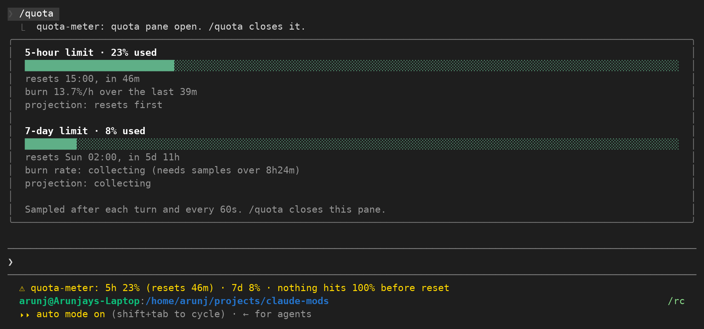

# quota-meter

Your Claude subscription has usage windows: a 5-hour one, a 7-day one, and on a Claude gateway a spend limit.
Claude Code reports how full each one is, but only inside a notice that appears when you are already close.
`quota-meter` keeps that reading on screen the whole session, adds a countdown to the reset, and works out how long the current pace can keep going.

## What it shows

**A pinned line under the prompt**, from the moment the session starts:

```
5h 15% (resets 1h23m) · 7d 6% · nothing hits 100% before reset
```

The tail is the useful part.
It is one of three things:

- `5h full in ~2h05m` - at the recent pace that window fills before it resets.
- `nothing hits 100% before reset` - every window resets before the pace could fill it.
- `collecting burn rate` - no window has been watched long enough yet to have a rate worth quoting. A window that is still collecting is simply left out of the tail; it never hides a window that does have a rate.

When the account reports no windows at all the line reads `no plan limits reported yet`.
That is the normal state for an API-key session and for the first few seconds of any session, before Claude has answered once.

**A pane, opened and closed with `/quota`**, one block per window:

```
5-hour limit · 15% used
██████████░░░░░░░░░░░░░░░░░░░░░░░░░░░░░░░░░░░░░░░░░░░░░░░░░░░░░░░
resets 15:00, in 1h23m
burn 24.4%/h over the last 2m
projection: resets first

7-day limit · 6% used
████░░░░░░░░░░░░░░░░░░░░░░░░░░░░░░░░░░░░░░░░░░░░░░░░░░░░░░░░░░░░░
resets Sun 02:00, in 5d 12h
burn 0.0%/h over the last 2m
projection: steady, not rising
```

The bar is drawn to the pane's own width, so it fits whether the pane is docked beside the transcript (110 columns and up, in the fullscreen layout) or sitting inline above the prompt on a narrow terminal.
The reset is given as a clock time and as a countdown, because one of the two is always the one you wanted.

## Install

```
claude plugin marketplace add Arunjay4213/claude-mods
claude plugin install quota-meter@claude-mods
```

Mods are early access, so the hooks module only loads when function hooks are switched on.
Add this to `~/.claude/settings.json`:

```json
{
  "env": { "CLAUDE_CODE_ENABLE_FUNCTION_HOOKS": "1" }
}
```

or set `CLAUDE_CODE_ENABLE_FUNCTION_HOOKS=1` on the command line for one run.

To try it straight from a checkout, without installing:

```
CLAUDE_CODE_ENABLE_FUNCTION_HOOKS=1 claude --plugin-dir plugins/quota-meter
```

## Screenshot



## How the projection is computed

`$.session.usage()` reports the windows the last API response carried, each as `{ kind, percentUsed, resetsAt }`.
The mod reads it after every finished turn and on a 60 second tick, and keeps each reading as `{ atMs, percentUsed }` in `$.store`.

- **The burn rate is a first-to-last slope**, not a least-squares fit: `(last percent - first percent) / (last time - first time)`, expressed as percent per hour.
  A straight slope is the right shape here because the readings inside one window are a step function that only rises, so a fit through the middle of it would understate the current position.
- **A rate is only quoted once the readings span 5% of the window**: 15 minutes for the 5-hour window, about 8.4 hours for the 7-day one (and for a spend limit, whose readings are kept on the same 7-day clock).
  Below that the mod says `collecting` in both surfaces rather than showing a number it does not have.
  The reason for the wait is that the API reports usage as a whole percent.
  A 7-day window that ticks from 6% to 7% during a 16 minute span reads as 3.8% per hour, which projects a full window in a day; the same single tick spread over 8.4 hours reads as the small movement it actually was.
  Percent values are rounded to whole numbers before anything is computed from them, because the API sometimes reports `7.000000000000001`.
- **The projection is the remaining percent divided by that rate**: `(100 - percentUsed) / burn`.
  If the window resets before that time arrives, the mod says `resets first` instead of a time you will never reach.
  If the rate is zero or falling, it says `steady, not rising`.
- **Readings are dropped when they stop being about this window.** Anything older than the window length goes, and a percent that fell by more than half a point means the window reset, so every reading before it is discarded.
  Readings persist in `$.store`, so restarting Claude Code inside the same window keeps the rate you had built up.

Nothing here is estimated or filled in.
If a figure is missing from the API it is reported as missing.

## Limitations

- **API-key sessions report no limits.** `rateLimits` is empty off a subscription, so the meter shows `no plan limits reported yet` and the pane says the same. There is nothing to read.
- **The first reading needs a turn.** At session start the last response is the previous session's, or there is none, so the line may say `no plan limits reported yet` until Claude answers once.
- **The 7-day window takes 8.4 hours to say anything.** That is the point at which its whole-percent readings stop being noise, so a fresh session shows `collecting` for it and projects only from the 5-hour window. The pane always prints the span a rate was measured over, so you can see how much to trust it.
- **`spend_limit` has no fixed length**, so its readings are kept for seven days, and it can read above 100% once the limit is passed. The bar stops at full; the percent does not.
- **One pane at a time.** `/quota` toggles: the second run closes it, as `/diff` does.

## Layout

```
.claude-plugin/plugin.json   name, version, description
hooks/hooks.json             names the module
hooks/register.tsx           the hooks: sampling, the status line, the command, the pane
hooks/quota.ts               the numbers and the wording, with no engine calls in them
```
