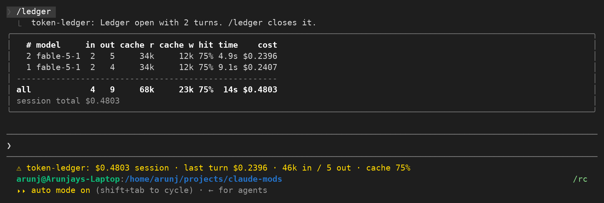

# token-ledger

A per-turn cost and token ledger for Claude Code, built as a mod (function hooks).

It answers one question while you work: what did that turn just cost, and is the cache doing its job.

## What it shows

**A pinned status line under the prompt**, updated when each turn ends:

```
$0.4799 session · last turn $0.2394 · 46k in / 5 out · cache 75%
```

`in` on this line is everything the answer was read over: fresh input, cache reads and cache writes together.
`cache` is the share of that which came from the cache.
Any figure the engine does not have is left out rather than guessed, so the line shortens instead of showing a zero or a blank.

**A pane opened by `/ledger`**, one row per turn, newest first:

```
  # model     in out cache r cache w hit time    cost
  2 fable-5-1  2   5     34k     12k 75% 2.8s $0.2394
  1 fable-5-1  2   4     34k     11k 75% 3.0s $0.2405
-----------------------------------------------------
all            4   9     68k     23k 75% 5.8s $0.4799
session total $0.4799
```

The `in` column here is the API's `input_tokens` on its own, the part that was neither read from the cache nor written to it.
Add `in`, `cache r` and `cache w` to get the `in` figure on the status line.

Run `/ledger` again to close it.
The pane docks beside the transcript from 110 terminal columns and sits inline above the prompt below that.

Columns are fitted to the pane width.
When the pane is too narrow for all of them they are dropped in this order: duration, cache write, turn number, model, hit ratio, cache read, output tokens, input tokens.
Cost is never dropped.
At 44 terminal columns, for example, duration and cache write go and the rest still lines up.

## Install

```
claude plugin marketplace add Arunjay4213/claude-mods
claude plugin install token-ledger@claude-mods
```

Mods are early access, so the module only loads when function hooks are switched on.
Add this to `~/.claude/settings.json`:

```json
{ "env": { "CLAUDE_CODE_ENABLE_FUNCTION_HOOKS": "1" } }
```

Or set it for one run: `CLAUDE_CODE_ENABLE_FUNCTION_HOOKS=1 claude`.

## Screenshot



## How the numbers are worked out

Token counts come straight from the `turn.complete` event: `e.usage.input_tokens`, `output_tokens`, `cache_read_input_tokens` and `cache_creation_input_tokens`, with `e.usage.model` for the model name and `e.durationMs` for the duration.
These are the API's own counts for the turn, not an estimate.

Cache hit ratio is `cache_read / (input + cache_read + cache_creation)`.
When that denominator is zero the cell shows `-` rather than a made-up number.

**Cost per turn is a difference, not a calculation.**
The session total comes from `$.session.usage()` as `cost.usd`, the same figure `/cost` and the status line report.
The ledger reads it once when the session starts and once after every turn, and a turn's cost is the change between the two readings.

There is deliberately no pricing table in this plugin.
Rates differ by model, by plan, by cache tier and by gateway, and they change.
A table baked into a plugin would go stale and report confident wrong numbers, so the ledger only ever reports what the engine already priced.

## Limitations

The first reading is taken at `session.start`, so a turn is only priced once the ledger has a baseline.
If the engine reports no cost at all (a host that keeps no cost ledger), the cost column shows `-` and the status line drops the dollar figures.

Cost is attributed to whichever turn finished between two readings.
A subagent's turn finishes inside the main turn, so its cost lands on the subagent's row and the main turn's row shows only what was left.
Subagent rows are marked with `*` after the turn number and drawn dim.

The ledger keeps the last 200 turns.
It is mirrored into `$.store` under the session id, so `/ledger` still has the history after `/resume`; a new session starts with an empty ledger rather than showing another session's turns.
The pane draws the newest 40 rows and counts the rest in the totals.

The dollar figures are rounded for display (2 decimals from $1, 4 below it).
The totals row adds the stored per-turn values, so it can differ from the session total by a fraction of a cent when rounding, or by more if some turns had no baseline.
The session total line is always the engine's own figure.
